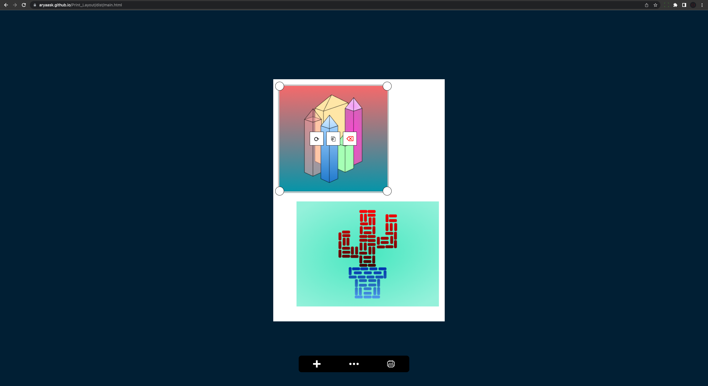

# Print Layout
## A small utility to help solve the problem of resizing when printing an image

### URL: https://aryaask.github.io/Print_Layout/dist

### iOS: https://apps.apple.com/us/app/print-layout/id1631719751

When printing an image to place somewhere, you usually want to be able to control the size at which it will be printed. However unfortuantely most of the time when you select print on an image, you will be prompted with a screen which only allows you a few pre-defined sizes, however they are not very customizable. 

This utility will allow you to quickly import 1 or more photos, and view their layout and size on a sheet of A4 (or another sized) Paper, this helps you visualize how large the photo will actually be when you print it, and eliminates the need to take the image into a much larger image/document editing program. For example many people will take the image to Microsoft Word or Adobe Photoshop, just to do a simple crop or resize, which should not be needed just to print out an image.

## Design
I want this app to be very minimal and fast, so the design is meant to look very clean. For example I'll try to only keep a few buttons in sight, the pan and zoom will just be control by mouse/gesture and scroll/pinch for desktop/mobile. This also means that I should spend quite a lot of time adding small shortcuts, such as the ability to drag and drop, copy and paste images onto the paper. These are improvements which will make the app very easy to use.

Here is a preview on desktop:\

And here are previews of the iOS app:

 
  
   

## Accuracy
Since the final outcome is for the document to be printed, I cannot fully fix all accuracy problems.\
Here is an example, I printed this test cube onto a piece of paper:

The image is 600 x 600, and so should get scaled down, and should be **20cm x 20cm** on paper:

However as you can see, there is an error margin of around 0.5cm, which is quite high. Unfortunately there is almost nothing I can do to fix this, a possible solution may be to set the quality of the image to the highest possible, which is an option for some printers.

## How it works
I had to learn more about the Javascript canvas API to make this work, as well as Image Encoding techniques and how to pass data between a WebView and native iOS applicaiton.\
Here are the steps to draw the image onto the screen (not exhaustive):
- Import image from local file system
- Convert image's size from PX to MM, using the MM->PX scale factor, this is calculated so that the A4 sheet of paper will fill the screen.
- Check image size, if it is too large then scale it down to fit on paper.
- The image's position is set using relative coordiantes to the paper, for example the top-left would have a left and top value of 0, 0.
- Canvas is updated inside 60fps animation loop, but it only redraws images when there is a change, to avoid too much performance loss.

To handle transformations I created a *transformation overlay*, I have a global variable which stores which image is currently being selected (hovered on desktop, and clicked on mobile). When an image is selected I show the overlay, and then hide it when the image is no longer selected. I then transform the image based on the pointer movements, e.g. if the pointer drags the image then the image is translated. 

I also had to create custom UI elements, and their own click handlers, since I cannot use elements inside of the canvas, this is how I added the resize buttons, I just check whether the cursor click is within a certain radius of the corner, if so then any drag will resize/scale the image rather than translate it. The buttons inside of the image are just regular buttons, since there was no need to render them on the canvas itself, instead I could just use HTML elements and change their Z-Index to be in front of the canvas.

Mobile controls are extremely similar, the only difference was that I had to use touch events instead of mouse events, and I also didn't have to check if the pointer was held down or not, since you cannot hover over anything in mobile.

### Exporting
When exporting the image, I have to make sure to increase the physical size of the canvas, so that all its images are at their highest resolution, then I convert the canvas into a PDF document using jsPDF, and then I print it. When you print an image you can actually see this happening, it will zoom in for 3 secconds, just to make sure that all images have been fully drawn out, and then take the snapshot. This tries to make sure that the result PDF / Print Document is high quality, however there are still a few smaller quality issues.

### Native App
I also added a mobile app, since it is even harder for a user to change an image's size on mobile.\
I just integrated the webpage into the native iOS app, by displaying a Webview, and then just executing JS commands from Swift (iOS's programming language), this was quite simple, however one challenge I faced was passing the image from the webpage to the local iOS device to be printed. To do this I had to convert the image into a Base64 encoded string, then I could just read the value from Swift, and then I had to decode the Base64 data into a UIImage, which I then printed.

Here are a few links to handle the 'Open With' feature of iOS:
- https://stackoverflow.com/questions/13106461/how-to-open-image-in-my-ios-app-from-another-app
- https://medium.com/macoclock/ios-share-extension-swift-5-1-1606263746b
- https://stackoverflow.com/questions/69926336/how-to-handle-a-file-shared-from-another-app-to-my-own-ios-app
- https://stackoverflow.com/questions/49154366/how-to-handle-a-file-sent-with-open-in-from-another-app-to-my-own-ios-app

Here are a few links to load a UIImage into a Website with Webkit:
- https://stackoverflow.com/questions/38743604/wkwebview-insert-uiimage-into-web-page
- https://stackoverflow.com/questions/24049343/call-javascript-function-from-native-code-in-wkwebview

*Unfortunately after trying a lot, I could not figure out how to open an image from the photos or safari app directly into this app, this would have been a very useful feature, but it seems like the only option is to make an embedded app inside a Share Extension. Even after making the app open from the files app, I was not able to use the URL to actually access the image*

## Performance
Since this app requires a lot of image rendering, performance is a large consideration. Here are the techniques I used to try and mitigate the performance issues:
- Only redraw images on a change, instead of every frame
- Redraw canvas at a different rate than the rest of the UI, every 3 ticks on desktop and every 4 ticks on mobile *(due to less power on mobile)*.
- Used a **buffer canvas** to draw all images to, once that has finished then I simply copy the contents over to the actual canvas.